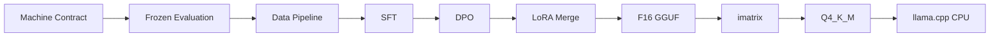

# HomeChef Booking Agent 小模型后训练与本地部署

面向上门私厨预约场景，将预约状态理解、槽位抽取、多轮状态继承、确认流程与 Tool Calling 等业务能力迁移至本地 Qwen3 小模型，并建立从评估、数据构建、SFT/DPO 到 GGUF 量化和 llama.cpp CPU 部署的后训练链路。

## 核心能力

- Booking Machine Contract：用 Pydantic、JSON Schema 和合同校验器固定模型输入、输出、状态、Tool Call 与 Tool Result 边界。
- Frozen Evaluation：用冻结样例、manifest、确定性 scorer 和原始输出留存约束模型选择过程。
- SFT / DPO：用 LLaMA-Factory、PEFT / LoRA 和配置化训练文件执行协议学习与偏好对齐。
- Structured / Unstructured Evaluation：同一 checkpoint 可在自由生成和 schema-constrained decoding 两种推理模式下分别评估。
- GGUF / imatrix / Q4_K_M：提供 LoRA merge、F16 GGUF、imatrix 校准与量化脚本边界。
- llama.cpp CPU Serving：通过 OpenAI-compatible `/v1/chat/completions` 接入本地 CPU 推理服务。

## 技术栈

Python 3.12、Pydantic、JSON Schema、PyYAML、pytest、ruff、Transformers、PyTorch、PEFT / LoRA、LLaMA-Factory、lm-format-enforcer、Qwen3、llama.cpp、GGUF、Q4_K_M。

## 技术流程



## 项目结构

```text
BOOKING_MACHINE_CONTRACT_v1.md  预约决策机器合同
SPEC.md                         当前总技术规范
finetune-spec.md                训练阶段设计文档
contracts/                      JSON Schema 与合同 manifest
configs/                        evaluation、inference、training、runtime 配置
data/                           冻结评估集、诊断集、合成训练数据与 manifest
scripts/                        数据、评估、训练、模型转换与部署辅助脚本
src/homechef_booking/           合同、schema、数据、评估、推理、训练实现
tests/                          单元测试、集成测试与合同 fixture
deployment/                     llama.cpp 转换脚本占位与本地部署边界
```

模型权重、adapter、checkpoint、GGUF、运行报告、日志和本地缓存不纳入 Git 仓库。

## 环境安装

```powershell
python -m venv .venv
.\.venv\Scripts\python -m pip install -e .
.\.venv\Scripts\python -m pip install pytest ruff
.\.venv\Scripts\python -m pip install -r requirements-train.txt
```

使用 `uv` 时可执行：

```powershell
uv sync --dev
```

推理依赖可通过项目的 `inference` dependency group 或等价 pip 依赖安装。

## 快速开始

合同校验：

```powershell
uv run homechef-contract-validate --root . --fixtures tests/fixtures/contracts
```

运行 mock evaluation：

```powershell
uv run homechef-eval --config configs/evaluation/phase01_mock.yaml --output-dir reports/generated/smoke
```

只读校验数据集并写出 manifest / data card：

```powershell
uv run python scripts/data/validate_dataset.py --raw data/raw/phase03_smoke_v0.1.jsonl --sft-train data/processed/phase03_smoke_sft_train.jsonl --sft-val data/processed/phase03_smoke_sft_val.jsonl --dpo-train data/processed/phase03_smoke_dpo_train.jsonl --dpo-val data/processed/phase03_smoke_dpo_val.jsonl --frozen data/eval/frozen_test.jsonl --diagnostic data/dev/diagnostic_dev.jsonl --manifest-out data/processed/phase03_smoke_manifest.v0.1.json --data-card-out data/processed/phase03_smoke_data_card.v0.1.json
```

渲染 SFT 训练配置：

```powershell
uv run python scripts/train/render_config.py --config configs/training/phase04_sft_qwen3_1_7b.yaml --output experiments/phase04/configs/phase04_sft_qwen3_1_7b.resolved.yaml
```

执行审批门控的 CPU 工程 dry-run：

```powershell
uv run python scripts/train/dryrun.py --stage sft --config configs/training/phase04_sft_qwen3_1_7b.yaml --sample-count 1 --max-steps 2 --approval-file project-log/phase04_dryrun_approval.json --local-model-path models/hf_cache/Qwen_Qwen3-1.7B-Base
uv run python scripts/train/dryrun.py --stage dpo --config configs/training/phase04_dpo_qwen3_1_7b_beta_0_1.yaml --sample-count 1 --max-steps 2 --approval-file project-log/phase04_dryrun_approval.json --local-model-path models/hf_cache/Qwen_Qwen3-1.7B-Base
```

生成 Phase04 evaluation matrix 配置，不运行推理：

```powershell
uv run python scripts/eval/run_phase04_matrix.py --write
```

运行 Phase04 Frozen Evaluation 需要本地存在对应 adapter：

```powershell
uv run python scripts/eval/run_phase04_frozen_matrix.py --output-root reports/generated/phase04/exploratory_currentdata --skip-complete
```

LoRA merge、校准语料、CPU benchmark 入口：

```powershell
uv run python phase05_merge.py
uv run python phase05_build_calibration.py
uv run python phase05_cpu_benchmark.py
```

llama.cpp base GGUF 准备脚本：

```powershell
.\scripts\models\prepare_phase02_base_gguf.ps1
```

该脚本依赖本机可用的 `deployment\llama_cpp\bin\llama-quantize.exe` 和 `deployment\llama_cpp\llama_cpp_src\convert_hf_to_gguf.py`，这些第三方二进制与下载源码不纳入 Git。

## 文档

- [SPEC.md](SPEC.md)：当前总技术规范。
- [BOOKING_MACHINE_CONTRACT_v1.md](BOOKING_MACHINE_CONTRACT_v1.md)：冻结机器合同。
- [finetune-spec.md](finetune-spec.md)：训练阶段详细设计文档。

## 模型与结果

仓库只保存源代码、配置、合同、测试、文档和小型可复现数据。模型权重、LoRA adapter、训练 checkpoint、GGUF、实验报告、benchmark 输出、日志与本地缓存默认留在本机或外部制品存储中，由使用者按照配置自行生成。
